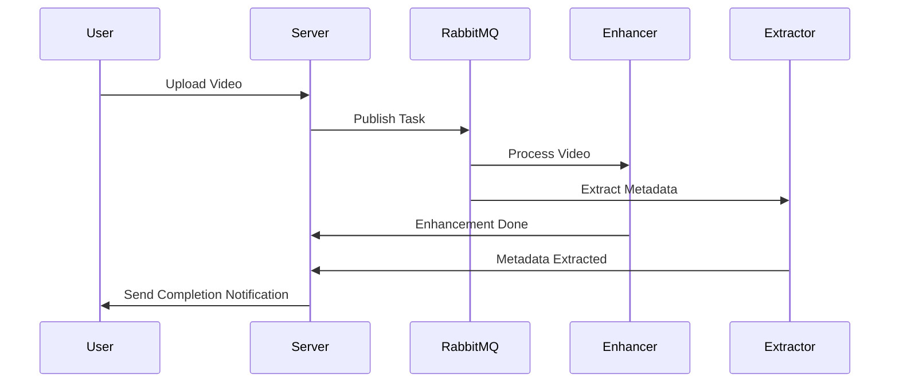

# Video Processing Pipeline

## Project Overview
Event-driven architecture for parallel video processing with:
- Video enhancement (brightness, contrast, resolution)
- Metadata extraction (duration, dimensions, framerate)
- Real-time progress updates

## Project Workflow
``` mathematica
User → React → /upload -------------+
                                   |
                            FastAPI Server
                            ↓ Save Video
                            ↓ Publish to RabbitMQ
                                   ↓
     ┌─────────────────────────────┴─────────────────────────────┐
     │                                                           │
Video Enhancement Worker                             Metadata Extraction Worker
     │                                                           │
Enhance & Save File                           Extract Metadata from File
     │                                                           │
→ POST enhancement status                → POST metadata status
       to FastAPI                                 to FastAPI
             ↓                                             ↓
       FastAPI checks if both tasks are done — then →
             → Sends WebSocket push to client
                          ↓
               React updates UI with:
       ✅ Enhanced Video | ✅ Metadata

 ```

## Architecture


## Tech Stack
- FastAPI (Python web framework)
- RabbitMQ (Message broker)
- FFmpeg (Video processing)
- WebSockets (Real-time updates)

## Task Exchange

```
[FastAPI Server]    <--- Tasks & Updates --->     [RabbitMQ]
     |                                             /       \
[Client Uploads]                    [Metadata Worker]    [Enhancement Worker]

```

## Installation
1. Install requirements:
```bash
pip install -r requirements.txt
```

2. Install RabbitMQ or Start a Docker container:
```bash
docker run -it --rm --name rabbitmq -p 5672:5672 rabbitmq
```

## Running the System
1. Start the server:
```bash
uvicorn assignment.server:app --reload
```

2. Start workers in separate terminals:
```bash
python assignment/workers/video_enhancement.py
python assignment/workers/metadata_extractor.py
```

## API Documentation
### Endpoints

#### 1. Video Upload
`POST /upload`
- Content-Type: multipart/form-data
- Parameters:
  - `file`: Video file to upload (required)

**Request Example:**
```bash
curl -X POST -F "file=@sample.mp4" http://localhost:8000/upload
```

**Success Response:**
```json
{
  "message": "Upload Successful",
  "video": "sample.mp4",
  "video_path": "/videos/sample.mp4"
}
```

**Error Responses:**
- 400: Invalid file type
- 500: Server error during processing

#### 2. Status Check
`GET /status/{filename}`
- Parameters:
  - `filename`: Name of uploaded video (required)

**Request Example:**
```bash
curl http://localhost:8000/status/sample.mp4
```

**Response Examples:**
Processing:
```json
{
  "video": "sample.mp4",
  "status": {
    "enhanced": false,
    "metadata": null
  }
}
```

Completed:
```json
{
  "video": "sample.mp4",
  "status": {
    "enhanced": true,
    "metadata": {
      "duration": 90.24,
      "width": 1920,
      "height": 1080
    }
  }
}
```

#### 3. WebSocket Updates
`WS /ws/{client_id}`
- Parameters:
  - `client_id`: Unique client identifier

**Connection Example:**
```javascript
const socket = new WebSocket('ws://localhost:8000/ws/client123');
socket.onmessage = (event) => {
  console.log('Update:', JSON.parse(event.data));
};
```

**Message Format:**
```json
{
  "video": "sample.mp4",
  "metadata": {
    "duration": 90.24,
    "width": 1920,
    "height": 1080
  },
  "enhanced_video_url": "/videos/sample_enhanced.mp4"
}
```

## Workflow Code
Main processing flow:
```python
# In server.py
@app.post("/upload/")
async def upload_video(file: UploadFile):
    video_path = save_upload(file)
    publish_task(video_path)  # Send to RabbitMQ
    return {"status": "processing"}
```

Video enhancement:
```python
# In video_enhancement.py
ffmpeg.input(video_path)
    .filter("eq", brightness=0.2, contrast=1.5)
    .filter("scale", 1920, 1080)
```

## Configuration Options
Environment variables:
- `RABBITMQ_HOST`: RabbitMQ server host (default: localhost)
- `RABBITMQ_PORT`: RabbitMQ server port (default: 5672)
- `UPLOAD_DIR`: Video upload directory (default: ./videos)

Video processing parameters (in video_enhancement.py):
```python
# Adjust these values as needed
FILTERS = {
    "brightness": 0.2,
    "contrast": 1.5,
    "fps": 60,
    "width": 1920,
    "height": 1080
}
```

## Troubleshooting
Common issues:

1. **FFmpeg errors**:
   - Ensure FFmpeg is installed and in PATH
   - Check file permissions on input/output directories

2. **RabbitMQ connection failures**:
   - Verify RabbitMQ service is running
   - Check host/port configuration

3. **WebSocket disconnections**:
   - Configure proper timeout values
   - Handle connection retries in client

## Examples
Sample Input/Output:

1. Original Video:
   - Resolution: 1280x720
   - Duration: 1:30
   - Framerate: 30fps

2. Enhanced Video:
   - Resolution: 1920x1080
   - Duration: 1:30
   - Framerate: 60fps
   - Improved brightness/contrast

Metadata Output (JSON):
```json
{
  "duration": 90.24,
  "width": 1920,
  "height": 1080,
  "frame_rate": 60
}
```

## Development Guide

### Debugging
Enabled debug logging:

```python
# In any worker file
logging.basicConfig(level=logging.DEBUG)
```

### Contributing
1. Fork the repository
2. Create a feature branch
3. Submit a pull request


## **Further Enhancements**
1. **Add File Size Limit**:
   - Use `Content-Length` headers or monitor the file size during saving to enforce a size restriction.
   
2. **Integrate with FFmpeg or WriteGear**:
   - Once the video is uploaded, you can use tools like `FFmpeg` (or VidGear’s `WriteGear`) to process the video (e.g., compression, format conversion).

3. **Implement Streaming**:
   - Add a GET endpoint to serve the uploaded videos using streaming for efficient delivery.

## References
- [Extracting Metadata from Audio/Video with Python](https://appdividend.com/extract-metadata-from-audio-and-video-with-python/)
- [RabbitMQ Exchange Types Explained](https://medium.com/trendyol-tech/rabbitmq-exchange-types-d7e1f51ec825)
- [Why Declare Exchanges in RabbitMQ](https://stackoverflow.com/questions/25832049/why-declare-exchange-in-rabbitmq)
- [FFmpeg Video Filters Documentation](https://ffmpeg.org/ffmpeg-filters.html#Video-Filters)
- [Pika Python Client Documentation](https://pika.readthedocs.io/en/stable/examples.html)
- [RabbitMQ with Python Guide](https://medium.com/analytics-vidhya/how-to-use-rabbitmq-with-python-e0ccfe7fa959)
- [Pub/Sub with FastAPI and RabbitMQ](https://itracer.medium.com/rabbitmq-publisher-and-consumer-with-fastapi-175fe87aefe1)
- [RabbitMQ with FastAPI and WebSockets](https://stackoverflow.com/questions/59782884/rabbitmq-flask-fastapi-and-websockets)


## License
MIT
